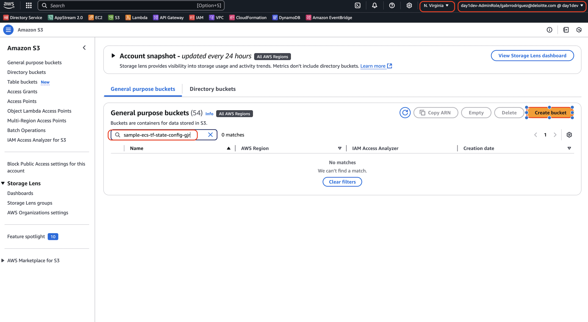

# Sample Terraform ECS Deployment

## Resources Created

## Architectures

## Procedure

### TF State Backend
1. This procedure can be automated but if doing for the first time its just as easy to do manual with no clear advantage to automate. If you automate this step in your TF code you will have to comment out the code if running for anytime `NOT` the first time. 

2. Go to AWS console > S3 service

3. Create a unique bucket name that indicates the bucket is for the purpose of maintaining TF state file. Configure the bucket to the desired region. 

Bucket configuration is as follows:
- [ ] Bucket Type: General Purpose
- [ ] Bucket Name: sample-ecs-tf-config-gjr
- [ ] Object Ownership: ACLs disabled (recommended)
- [ ] Block all public access: true
- [ ] Bucket Versioning: Disable
- [ ] Tags: Optional
- [ ] Encryption type: Server-side encryption with Amazon S3 managed keys (SSE-S3)
- [ ] Bucket Key: Enable
- [ ] Advanced Settings: Disable

## Questions for Client Env
- [ ] Is there an existiing location to store a TF State manifest folder / bucket?
- [ ] If not, and one needs to be created is there a region that the bucket must be created? 
- [ ] Is there a particular configuration required to create an S3 bucket? (e.g naming convention, versioning enabled, etc.) 

